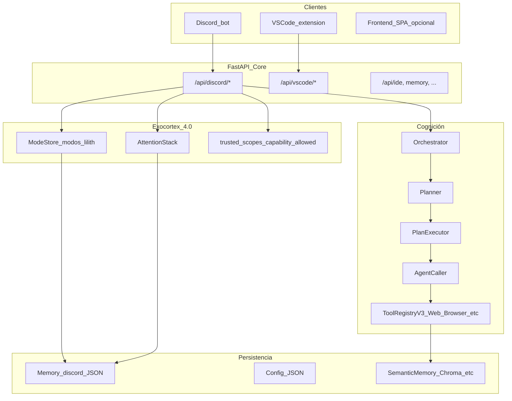

# Esquema completo Lilith 4.0 (referencia para 4.1)

Resumen de **qué es hoy** el sistema 4.0 en código y operación. Mapa base para planificar **4.1**.

## 1. Visión en una frase

**Lilith 4.0** es un backend FastAPI (`Core/Backend/api/server.py`) que orquesta agentes y herramientas (Planner → PlanExecutor → AgentCaller), expone chat e investigación a Discord vía HTTP, y añade un **Exocórtex operativo**: modo por canal/hilo, pendientes de sesión, ámbitos por usuario trusted y entrada VS Code mínima.

## 2. Arquitectura por capas

## 3. Flujo principal de conversación (owner en Discord)

1. `POST /api/discord/chat` con `text`, `user_id`, `role`, `channel_id`, `thread_id`.
2. Permisos: `capability_allowed(user_id, role, capability)` + `Config/trusted_scopes.json`.
3. `system_prompt`: persona + `[Modo_Activo]` + `[Pendientes_de_sesion]` + memoria de hilo + contexto.
4. Owner con `orchestrator_full`: relay, orquestador; trusted/public: charla, confirmaciones, etc.

## 4. Superficie API Discord (implementada)

| Área | Rutas |
|------|-------|
| Chat / plan | `POST /chat`, `/chat/plan-preview`, `/pregunta_rapida`, `/investiga` (SSE) |
| Modo canal/hilo | `GET/POST /mode` |
| Modo persona global | `GET/PATCH /persona-mode` |
| Atención | `GET /attention`, `POST /attention/add`, `/complete`, `/clear_completed` |
| Trusted scopes | `GET /trusted-scopes`, `POST /trusted-scopes/set` |
| Confirmaciones / notas | `/confirm`, `/pending-for-dm`, `/notes/*`, `/notebook` |
| Auto-learn | `/auto-learn/*` |
| Auditoría | `GET /audit`, `/audit/download` |

Archivo: `Core/Backend/api/discord_api.py`.

## 5. VS Code V1

- `POST /api/vscode/ask` (`vscode_api.py`), header `X-Lilith-VSCode-Token` / env `LILITH_VSCODE_TOKEN`.
- Extensión: `Lilith/VSCode/`, comando `lilith.ask`.

## 6. Datos clave

| Recurso | Ubicación |
|---------|-----------|
| Modos definidos | `Config/modos_lilith.json` |
| Modo por canal/hilo | `Memory/discord/mode_by_channel.json` |
| Pendientes | `Memory/discord/attention_stack.json` |
| Trusted overrides | `Config/trusted_scopes.json` |
| Roles base | `Config/discord_roles.json` |

## 7. Agencia web y Playwright

Pipeline minería documentado en Core/Docs. **BrowserTool** depende de Playwright + event loop en Windows (Selector); ver `run_api_windows.py` y DRY_RUN_WINDOWS.

## 8. Huecos hacia 4.1

- Delegador universal / auto-delegación (ver `LILITH_4_1_AUTO_DELEGACION.md`).
- Episódica enriquecida y metacognición (PLAN_AUTOMEJORA Fase B).
