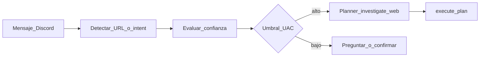

# Lilith 4.1 — Auto-delegación (diseño)

**Objetivo:** que Lilith **inicie sola** cadenas de herramientas (navegación, scrape, resumen) cuando el usuario envía una URL o una intención explícita, sin obligar a escribir `/investiga` o comandos rígidos.

**Estado:** diseño + config stub `Config/auto_delegate.json` (`enabled: false` hasta implementación).

---

## 1. Disparadores (cuándo auto-delegar)

| Señal | Ejemplo | Riesgo |
|-------|---------|--------|
| URL HTTP(S) en el mensaje | `https://blender.org/...` + "es este" | Alto si se ejecuta sin confirmación |
| Frases de investigación | "mira qué dice la web sobre X" | Medio |
| Solo URL, mensaje corto | &lt; 200 chars, 1 URL | Candidato fuerte si owner |

**Propuesta V1:** solo **owner**, solo si `auto_delegate.enabled` y canal/DM permitido. Trusted opcional vía `allow_trusted: false` por defecto.

---

## 2. Pipeline propuesto

1. **Detección:** regex URL + opcional clasificador ligero (palabras clave) o intent existente `investigate_web`.
2. **Confianza:** heurística (owner, longitud mensaje, dominio en allowlist `Config/web_sources.json`) o score del Planner si expone `confidence` en 4.1.
3. **UAC:** si confianza &lt; umbral o dominio no listado → no ejecutar; responder "¿Quieres que investigue esta URL? (sí/no)" o embed de confirmación (reutilizar flujo confirmaciones Discord).
4. **Ejecución:** construir mensaje tipo el de `/investiga` y llamar `orchestrator.execute_plan(...)` **o** redirigir internamente al mismo código que SSE (sin duplicar minería).

---

## 3. Puntos de integración en código (4.1)

| Componente | Cambio |
|------------|--------|
| `discord_api.py` | Tras construir contexto owner, antes del relay: si `auto_delegate.enabled` y match URL → rama `auto_investigate` o encolar job. |
| `Config/auto_delegate.json` | `enabled`, `min_confidence`, `require_owner`, `allowed_domains_extra`, `max_auto_per_hour`. |
| Planner | Opcional: devolver `confidence` y `suggested_tools` para metacognición. |
| Auditoría | Log `auto_delegate_triggered` con URL hash + outcome. |

---

## 4. Relación con Playwright

Auto-delegación que termine en `browser_*` **requiere** BrowserEngine operativo (event loop Windows corregido). Sin Playwright, la rama debe caer a **WebScraper por requests** (sin JS) o informar al usuario.

---

## 5. Criterios de cierre 4.1 (auto-delegación)

- [ ] Config activable sin romper flujo actual.
- [ ] Owner: URL + texto corto → resumen automático o confirmación explícita según config.
- [ ] Trusted no auto-ejecuta por defecto.
- [ ] Entrada en auditoría de decisiones.
