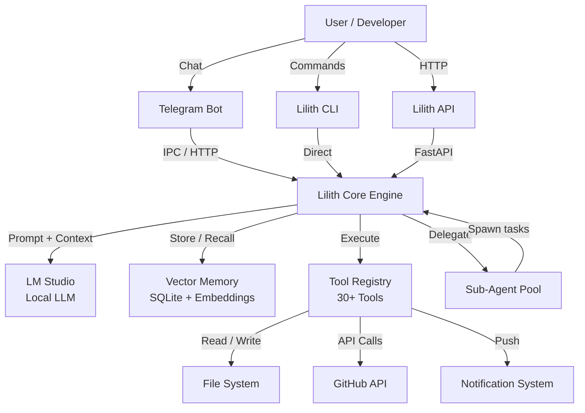
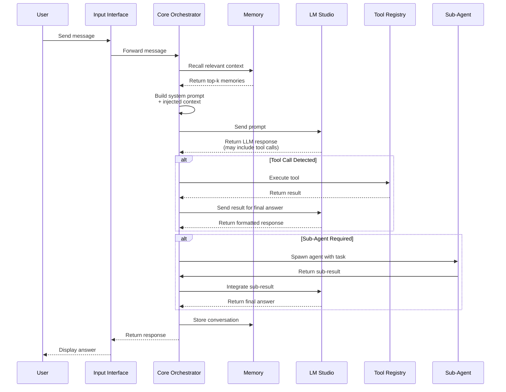
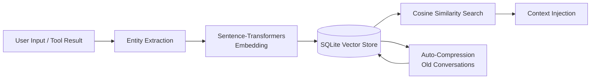
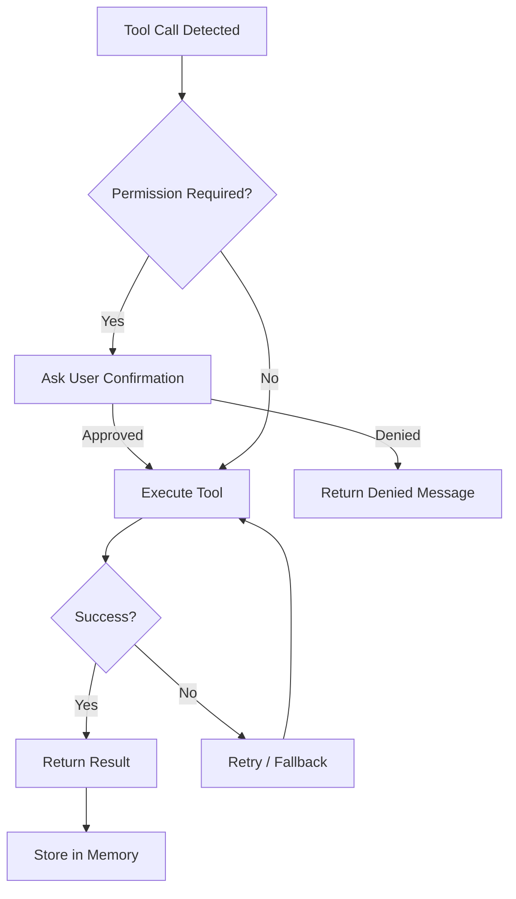
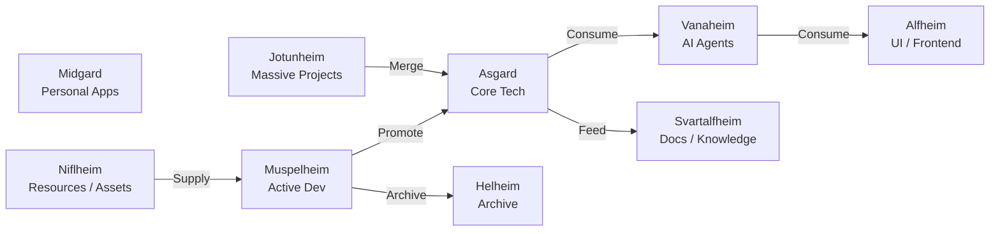
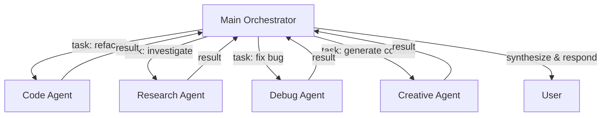
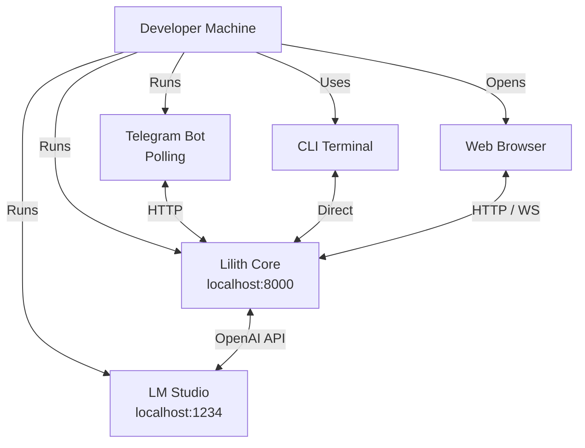

# Yggdrasil Architecture

High-level system design and data flow diagrams.

---

## System Overview

---

## Message Flow

---

## Memory Pipeline

---

## Tool Execution Flow

---

## Nine Realms Data Flow

---

## Sub-Agent Delegation

---

## Deployment Architecture

